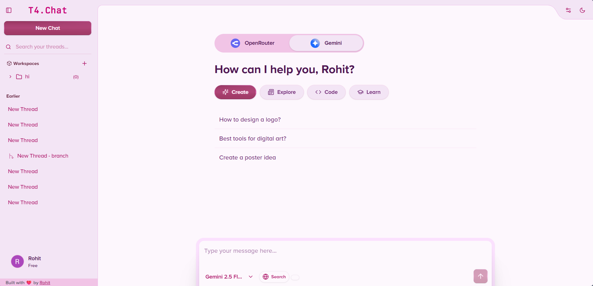

# T4.Chat - Power Clone of T3.Chat

## ✨ Key Features

- **🔧 Dynamic Tool System** - Add any tool dynamically (image generation, web search, etc.)
- **🎨 Pixel-Perfect UI** - Consistent design with precise attention to detail
- **🧠 Smart Prompt Engineering** - Optimized AI behavior for relevant responses
- **🔗 OpenRouter Integration** - Effortless access to multiple LLM models
- **🤖 100+ LLM Models Access** - Wide variety of AI models for different use cases
- **🤖 Smart Workspace Management** - Seamlessly Create, update, and delete workspaces

## 🚀 Getting Started

### Prerequisites

- Node.js 18+, MongoDB, Google OAuth credentials
